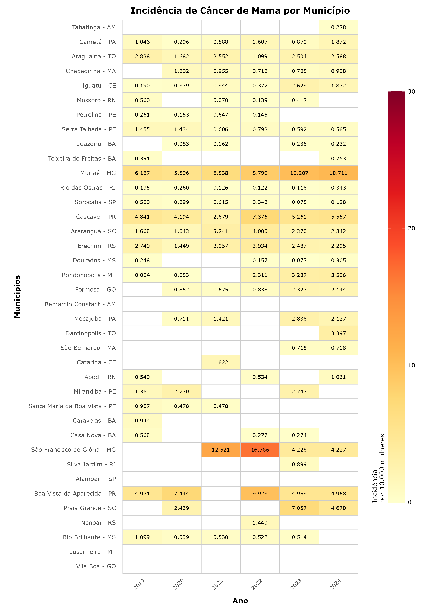
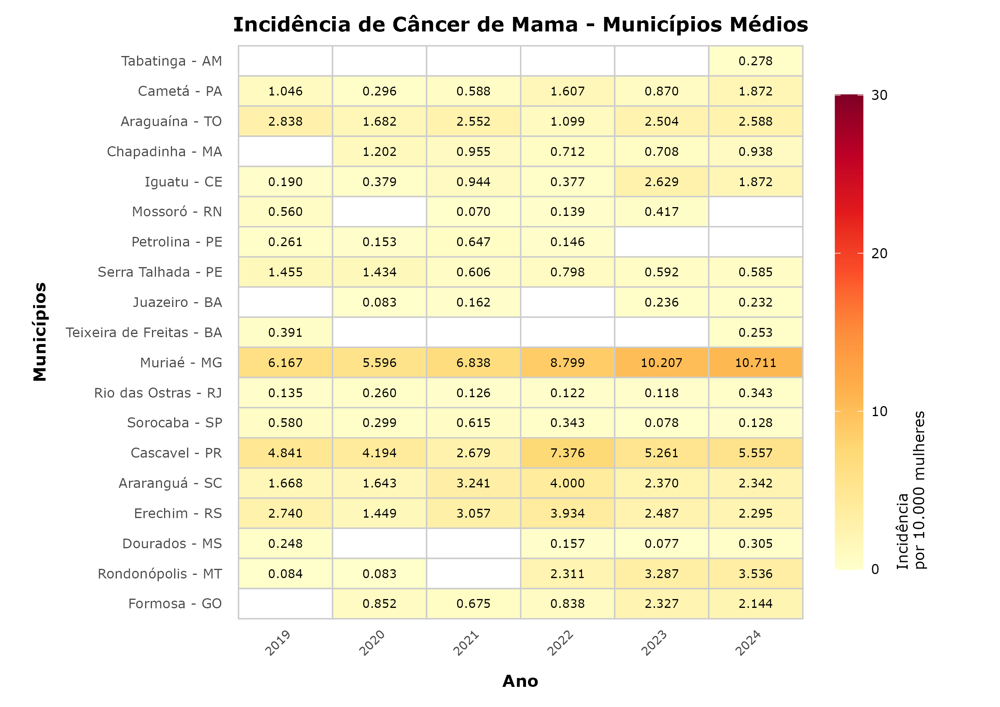
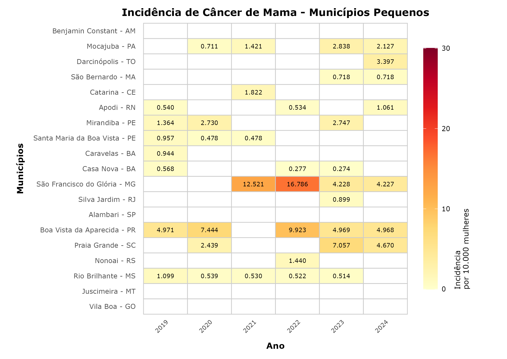
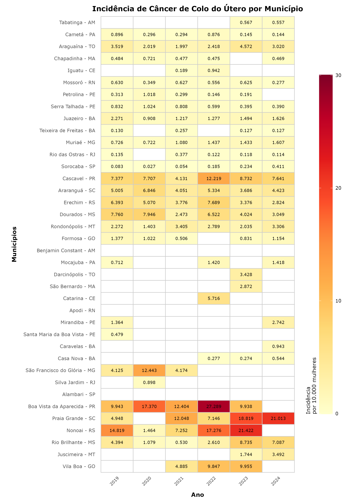
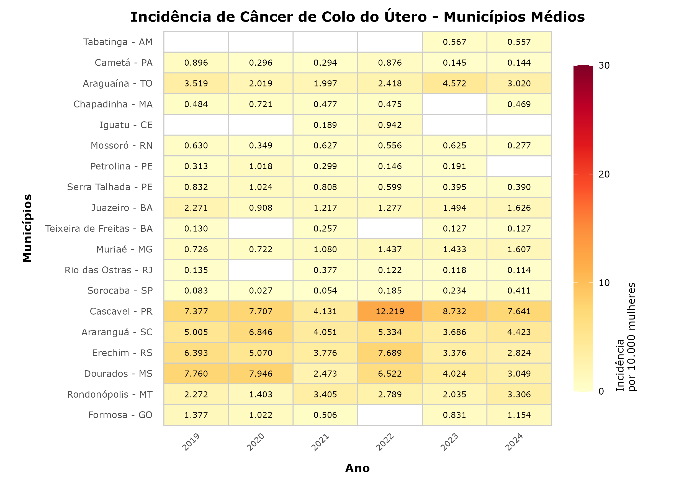
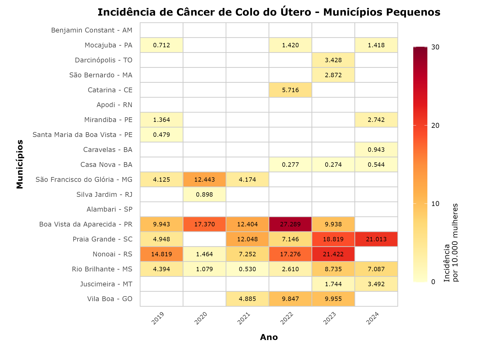
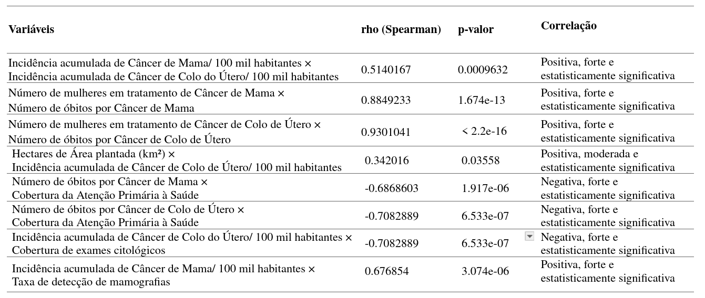
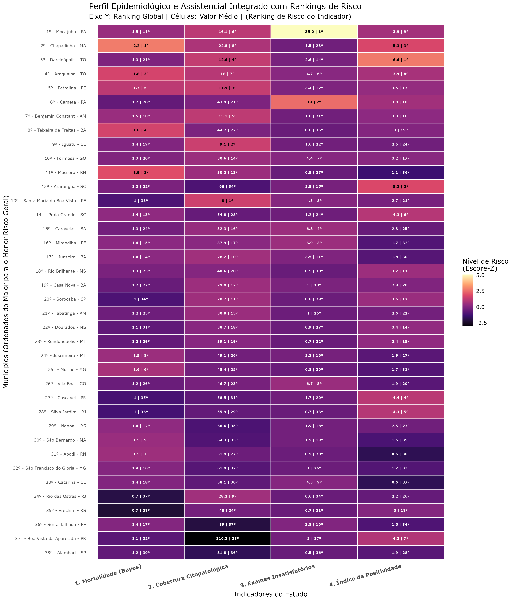

## Objetivo Geral

Analisar o acesso aos serviços de tratamento para doenças de alta complexidade, sob uma perspectiva interseccional, considerando relações de gênero, raça, etnia e local de moradia, a fim de contribuir com as políticas sociais que visam minimizar ou erradicar as desigualdades sociais.

Analisar a mobilidade e o acesso à saúde da população rural, moradora de cidades pequenas e médias das diferentes regiões brasileiras ao SUS, considerando as desigualdades socioterritoriais, etnicorraciais e de gênero para a identificação de Determinantes Sociais em Saúde (DSS) no processo saúde-doença.

## Objetivos Específicos

1.  Identificar a incidência de câncer de mama e do colo do útero nos municípios selecionados.
2.  Investigar as demandas de tratamentos oncológicos (mama e colo do útero) a fim de analisar o fluxo.
3.  Investigar as dificuldades encontradas pelas usuárias residentes nos municípios selecionados para acessar os serviços para tratamento de câncer de mama e do colo do útero.
4.  Analisar a mobilidade e o acesso à saúde das mulheres rurais, residentes em cidades pequenas e médias, considerando as desigualdades socioterritoriais, etnicorraciais e de gênero no processo saúde-doença.
5.  Identificar os serviços de saúde para diagnóstico e tratamento de câncer de mama e do colo do útero.
6.  Investigar o acesso ao transporte e as condições de mobilidade dos pacientes e familiares para o tratamento de câncer.\
7.  Analisar como o trabalho de cuidados com pacientes oncológicas realizado pelas mulheres rurais é agravado devido às grandes distâncias percorridas para acessar à saúde pública.\
8.  Estabelecer uma comparação entre as macrorregiões brasileiras em relação ao acesso de mulheres rurais aos serviços de saúde de alta complexidade.\
9.  Investigar a prevalência de doenças decorrente da contaminação da COVID, considerando gênero, raça e etnia.\
10. Elaborar sugestões e estratégias para proporcionar e aprimorar o acesso das populações rurais e dos interiores aos serviços de tratamento de câncer de mama e do colo do útero junto ao Ministério da Saúde e secretarias de saúde.\
11. Estimular o debate acadêmico, técnico, científico e popular sobre as desigualdades socioterritoriais que acometem as populações rurais e interioranas para acessar os serviços de saúde que garantem a qualidade de vida.

## Banco de dados minerados e descrição das variáveis

```{r carregar_dados_interativos, echo=FALSE, message=FALSE, warning=FALSE}
# Pacotes necessários
library(readxl)
library(DT)

# Leitura da planilha com os dados definitivos
dados <- readxl::read_excel("Banco_de_dados_definitivos.xlsx")

# Visualização interativa dos dados definitivos
DT::datatable(
  dados,
  options = list(pageLength = 10, scrollX = TRUE),
  caption = "Banco de dados definitivo - Projeto Travessia da Saúde"
)

# Ler o dicionário de variáveis
variable_description <- read_excel("Dicionario_de_variaveis.xlsx")

# Tabela interativa com a descrição das variáveis
DT::datatable(
  variable_description,
  options = list(pageLength = 10, scrollX = TRUE),
  caption = "Dicionário de Variáveis do Projeto"
)


```

# 1. Identificar a incidência de câncer de mama e do colo do útero nos municípios selecionados.

## Cálculo da Incidência de Câncer de Mama

A incidência de câncer de mama foi calculada como a razão entre o número de exames histopatológicos alterados registrados no período de 2019 a 2024 e a população feminina elegível (mulheres de 50 a 69 anos) em cada município.

Para os gráficos de incidência de câncer de mama e do colo do útero por município, foram utilizados dois scripts em R: o primeiro calcula os indicadores e salva um arquivo .xlsx, cada uma contendo abas separadas com as respectivas incidências para mama e para colo por municipio; o segundo lê esse .xlsx e gera as figuras correspondentes (heatmaps)

#### Codigo que gera o arquivo .xlsx com as incidências calculadas

```{r echo=FALSE, message=FALSE, warning=FALSE}
#### Preparação das bases para gerar os heat maps de incidencias ######

#### Municipios ####

# 1. Carregar pacotes
library(readxl)
library(dplyr)
library(tidyr)
library(writexl)

# 2. Parâmetros gerais
arquivo <- "dados_municipios.xlsx"
anos <- 2019:2024

# Ordem fixa dos municípios
ordem_municipios <- c(
  "Tabatinga - AM", "Cametá - PA", "Araguaína - TO", "Chapadinha - MA", "Iguatu - CE", "Mossoró - RN",
  "Petrolina - PE", "Serra Talhada - PE", "Juazeiro - BA", "Teixeira de Freitas - BA", "Muriaé - MG",
  "Rio das Ostras - RJ", "Sorocaba - SP", "Cascavel - PR", "Araranguá - SC", "Erechim - RS",
  "Dourados - MS", "Rondonópolis - MT", "Formosa - GO", "Benjamin Constant - AM", "Mocajuba - PA",
  "Darcinópolis - TO", "São Bernardo - MA", "Catarina - CE", "Apodi - RN", "Mirandiba - PE",
  "Santa Maria da Boa Vista - PE", "Caravelas - BA", "Casa Nova - BA", "São Francisco do Glória - MG",
  "Silva Jardim - RJ", "Alambari - SP", "Boa Vista da Aparecida - PR", "Praia Grande - SC",
  "Nonoai - RS", "Rio Brilhante - MS", "Juscimeira - MT", "Vila Boa - GO"
)


# 3. Função auxiliar para calcular incidência
calcular_incidencia <- function(dados, tipo = c("mama", "colo")) {
  tipo <- match.arg(tipo)
  
  # Definir nomes de variáveis conforme tipo
  variaveis_fixas <- c("Municipio_mun", "TamanhodoMunicipio_mun")
  variaveis_pop <- paste0("POP_Feminina_", anos, "_mun")
  variaveis_cancer <- paste0("Cancer_", ifelse(tipo == "mama", "Mama", "Colo"), "_", anos, "_mun")
  
  # Selecionar apenas as colunas necessárias
  df <- dados[, c(variaveis_fixas, variaveis_pop, variaveis_cancer)]
  
  # Garantir numéricas
  df[, c(variaveis_pop, variaveis_cancer)] <- lapply(df[, c(variaveis_pop, variaveis_cancer)], as.numeric)
  
  # Loop para cálculo da incidência por 10k mulheres
  for (ano in anos) {
    df[[paste0("incidencia_", tipo, "_10k_", ano)]] <-
      (df[[paste0("Cancer_", ifelse(tipo == "mama", "Mama", "Colo"), "_", ano, "_mun")]] /
         df[[paste0("POP_Feminina_", ano, "_mun")]]) * 10000
  }
  
  # Ordenar os municípios
  df <- df %>%
    mutate(Municipio_mun = factor(Municipio_mun, levels = ordem_municipios)) %>%
    arrange(Municipio_mun)
  
  # Pivotar no formato final (um município por linha, anos nas colunas)
  tabela <- df %>%
    select(Municipio_mun, TamanhodoMunicipio_mun, starts_with(paste0("incidencia_", tipo, "_10k_"))) %>%
    pivot_longer(cols = starts_with(paste0("incidencia_", tipo, "_10k_")),
                 names_to = "Ano",
                 names_prefix = paste0("incidencia_", tipo, "_10k_"),
                 values_to = paste0("incidencia_", tipo, "_10k")) %>%
    pivot_wider(names_from = Ano, values_from = paste0("incidencia_", tipo, "_10k")) %>%
    arrange(factor(Municipio_mun, levels = ordem_municipios))
  
  return(tabela)
}

# 4. Ler as duas abas da planilha
dados_mama <- read_excel(arquivo, sheet = "MAMA")
dados_colo <- read_excel(arquivo, sheet = "COLO")

# 5. Calcular incidências para mama e colo
tabela_mama <- calcular_incidencia(dados_mama, tipo = "mama")
tabela_colo <- calcular_incidencia(dados_colo, tipo = "colo")

# 6. Salvar em um único Excel
write_xlsx(
  list(
    "Incidência Mama 10k" = tabela_mama,
    "Incidência Colo 10k" = tabela_colo
  ),
  "incidencias_mama_colo_10k_municipios.xlsx"
)

cat("✅ Planilha gerada: incidencias_mama_colo_10k_municipios.xlsx\n")


```

### Planilha gerada pelo código

```{r echo=FALSE, message=FALSE, warning=FALSE}

library(readxl)
library(DT)

# Lê as abas do arquivo no mesmo diretório do .Rmd
arquivo <- "incidencias_mama_colo_10k_municipios.xlsx"
stopifnot(file.exists(arquivo))

incidencia_mama <- read_excel(arquivo, sheet = "Incidência Mama 10k")
incidencia_colo <- read_excel(arquivo, sheet = "Incidência Colo 10k")

# Identifica colunas numéricas
num_cols_mama <- which(sapply(incidencia_mama, is.numeric))
num_cols_colo <- which(sapply(incidencia_colo, is.numeric))

# Tabelas interativas
# mama
datatable(incidencia_mama, options = list(pageLength = 10, scrollX = TRUE)) |>
  formatRound(columns = num_cols_mama, digits = 3)

# colo
datatable(incidencia_colo, options = list(pageLength = 10, scrollX = TRUE)) |>
  formatRound(columns = num_cols_colo, digits = 3)

```

### Codigo que gera o os gráficos de calor das indicidências

```{r echo=FALSE, message=FALSE, warning=FALSE}
####### Incidências municipios #########


# Pacotes necessários 
library(readxl)
library(dplyr)
library(tidyr)
library(ggplot2)
library(pheatmap)    # para heatmaps
library(gridExtra)
library(RColorBrewer)


# 1. Carregar a planilha de incidências
arquivo <- "incidencias_mama_colo_10k_municipios.xlsx"

# Ler abas separadas
mama_df <- read_excel(arquivo, sheet = "Incidência Mama 10k")
colo_df <- read_excel(arquivo, sheet = "Incidência Colo 10k")


# 2. Função para preparar os dados (formato longo para ggplot)
preparar_heatmap_ggplot <- function(df) {
  df_long <- df %>%
    pivot_longer(
      cols = -c(Municipio_mun, TamanhodoMunicipio_mun),
      names_to = "Ano",
      values_to = "Valor"
    ) %>%
    mutate(
      # Limpar nomes dos anos (remover prefixos como incidencia_mama_10k_)
      Ano = gsub("[^0-9]", "", Ano),
      Ano = as.factor(Ano),
      # Zeros tratados como NA para ficarem brancos
      Valor = ifelse(Valor == 0, NA, Valor)
    )
  return(df_long)
}

mama_long <- preparar_heatmap_ggplot(mama_df)
colo_long <- preparar_heatmap_ggplot(colo_df)


# 3. Função para gerar heatmap
gerar_heatmap_ggplot <- function(df_long, titulo, output) {
  
  # Ordem dos municípios (mantendo a mesma lista da referência)
  ordem_municipios <- unique(df_long$Municipio_mun)
  df_long$Municipio_mun <- factor(df_long$Municipio_mun, levels = rev(ordem_municipios)) # invertido para alinhar
  
  # Paleta YlOrRd
  cores <- brewer.pal(9, "YlOrRd")
  
  p <- ggplot(df_long, aes(x = Ano, y = Municipio_mun, fill = Valor)) +
    geom_tile(color = "gray80", linewidth = 0.4, na.rm = FALSE) +
    geom_text(aes(label = ifelse(is.na(Valor), "", sprintf("%.3f", Valor))), size = 2.5) +
    scale_fill_gradientn(
      colors = cores,
      limits = c(0, 30),
      na.value = "white",
      name = "Incidência\npor 10.000 mulheres"
    ) +
    labs(
      title = titulo,
      x = "Ano",
      y = "Municípios"
    ) +
    theme_minimal(base_size = 9) +
    theme(
      axis.text.x = element_text(angle = 45, hjust = 1),
      axis.text.y = element_text(size = 8),
      axis.title.x = element_text(size = 10, face = "bold", margin = margin(t = 10)),
      axis.title.y = element_text(size = 10, face = "bold", angle = 90, margin = margin(r = 10)),
      plot.title = element_text(hjust = 0.5, size = 12, face = "bold"),
      legend.title = element_text(size = 9),
      legend.text = element_text(size = 8),
      legend.position = "right",
      panel.grid = element_blank(),
      plot.margin = margin(10, 20, 10, 20)
    ) +
    guides(
      fill = guide_colorbar(
        direction = "vertical",       # barra na vertical
        barwidth = unit(0.8, "cm"),   # largura fina
        barheight = unit(200, "mm"),  # altura grande acompanhando eixo Y
        title.position = "left",      # título à esquerda da barra
        title.theme = element_text(angle = 90, size = 9) # título na vertical
      )
    )
  
  
  # Salvar com proporção A4 retrato
  ggsave(output, p, width = 8.27, height = 11.69, units = "in", dpi = 300, bg = "white")
}


# 4. Gerar os heatmaps
gerar_heatmap_ggplot(
  mama_long,
  "Incidência de Câncer de Mama por Município",
  "heatmap_mama_final_ggplot.png"
)

gerar_heatmap_ggplot(
  colo_long,
  "Incidência de Câncer de Colo do Útero por Município",
  "heatmap_colo_final_ggplot.png"
)

cat("✅ Heatmaps gerados com ggplot2: heatmap_mama_final_ggplot.png e heatmap_colo_final_ggplot.png\n")


############# plot heatmap separado por municipios ############

# 1. Carregar planilha

arquivo <- "incidencias_mama_colo_10k_municipios.xlsx"
mama_df <- read_excel(arquivo, sheet = "Incidência Mama 10k")
colo_df <- read_excel(arquivo, sheet = "Incidência Colo 10k")

# 2. Função para preparar os dados (formato longo para ggplot)
preparar_heatmap_ggplot <- function(df, filtro_tamanho = NULL) {
  if (!is.null(filtro_tamanho)) {
    df <- df %>% filter(TamanhodoMunicipio_mun == filtro_tamanho)
  }
  
  df_long <- df %>%
    pivot_longer(
      cols = -c(Municipio_mun, TamanhodoMunicipio_mun),
      names_to = "Ano",
      values_to = "Valor"
    ) %>%
    mutate(
      Ano = gsub("[^0-9]", "", Ano),        # extrair só ano
      Ano = as.factor(Ano),
      Valor = ifelse(Valor == 0, NA, Valor) # zeros viram NA
    )
  return(df_long)
}


# 3. Função para gerar heatmap no estilo da referência
gerar_heatmap_ggplot <- function(df_long, titulo, output) {
  
  # Ordem dos municípios filtrados
  ordem_municipios <- unique(df_long$Municipio_mun)
  df_long$Municipio_mun <- factor(df_long$Municipio_mun, levels = rev(ordem_municipios))
  
  # Paleta YlOrRd
  cores <- brewer.pal(9, "YlOrRd")
  
  p <- ggplot(df_long, aes(x = Ano, y = Municipio_mun, fill = Valor)) +
    geom_tile(color = "gray80", linewidth = 0.4, na.rm = FALSE) +
    geom_text(aes(label = ifelse(is.na(Valor), "", sprintf("%.3f", Valor))), size = 2.5) +
    scale_fill_gradientn(
      colors = cores,
      limits = c(0, 30),
      na.value = "white",
      name = "Incidência\npor 10.000 mulheres"
    ) +
    labs(
      title = titulo,
      x = "Ano",
      y = "Municípios"
    ) +
    theme_minimal(base_size = 9) +
    theme(
      axis.text.x = element_text(angle = 45, hjust = 1),
      axis.text.y = element_text(size = 8),
      axis.title.x = element_text(size = 10, face = "bold", margin = margin(t = 10)),
      axis.title.y = element_text(size = 10, face = "bold", angle = 90, margin = margin(r = 10)),
      plot.title = element_text(hjust = 0.5, size = 12, face = "bold"),
      legend.title = element_text(size = 9),
      legend.text = element_text(size = 8),
      legend.position = "right",
      panel.grid = element_blank(),
      plot.margin = margin(10, 40, 10, 20)
    ) +
    guides(
      fill = guide_colorbar(
        direction = "vertical",
        barwidth = unit(0.6, "cm"),
        barheight = unit(100, "mm"),  # barra acompanha altura do gráfico
        title.position = "right",
        title.theme = element_text(angle = 90, size = 9)
      )
    )
  
  # Salvar com fundo branco e proporção A4
  ggsave(output, p, width = 8.27, height = 5.85, units = "in", dpi = 300, bg = "white")
}

# 4. Preparar e gerar os gráficos para cada caso

# Mama - Médios
mama_medios <- preparar_heatmap_ggplot(mama_df, filtro_tamanho = "Médio")
gerar_heatmap_ggplot(mama_medios,
                     "Incidência de Câncer de Mama - Municípios Médios",
                     "heatmap_mama_medios.png")

# Mama - Pequenos
mama_pequenos <- preparar_heatmap_ggplot(mama_df, filtro_tamanho = "Pequeno")
gerar_heatmap_ggplot(mama_pequenos,
                     "Incidência de Câncer de Mama - Municípios Pequenos",
                     "heatmap_mama_pequenos.png")

# Colo - Médios
colo_medios <- preparar_heatmap_ggplot(colo_df, filtro_tamanho = "Médio")
gerar_heatmap_ggplot(colo_medios,
                     "Incidência de Câncer de Colo do Útero - Municípios Médios",
                     "heatmap_colo_medios.png")

# Colo - Pequenos
colo_pequenos <- preparar_heatmap_ggplot(colo_df, filtro_tamanho = "Pequeno")
gerar_heatmap_ggplot(colo_pequenos,
                     "Incidência de Câncer de Colo do Útero - Municípios Pequenos",
                     "heatmap_colo_pequenos.png")

cat("✅ Todos os heatmaps gerados: Mama (Médios + Pequenos) e Colo (Médios + Pequenos)\n")

```

### Figuras geradas pelo codigo

     

#### Resultados e discussão das incidências

O índice anual de incidência de câncer nos municípios estudados, foi calculado pela razão entre o número de casos confirmados da doença e a população de mulheres dos respectivos municípios, considerando o mesmo ano. Os índices específicos de câncer de mama e de colo do útero, expressos por 10 mil mulheres, referentes aos municípios investigados neste projeto de pesquisa, estão representados nas Figuras acima.

O levantamento das incidências de câncer de mama e de colo do útero nos municípios selecionados, no período de 2019 a 2024, revela oscilações ao longo do tempo. No caso do câncer de mama entre os municípios médios, observou-se crescimento em municípios como Muriaé-MG, que registrou incidência 6,17 em 2019 e 10,71 em 2024, seguido de Rondonópolis-MT, com incidência 0,08 em 2019 e 3,54 em 2024, e Iguatu-CE, que passou de aproximadamente 0,19 para 2,62 em 2023. Por outro lado, Araranguá-SC apresentou queda, seguida de crescimento ao longo desses anos, com incidência de 1,67 para 4,00 em 2022 e para 2,34 em 2024, enquanto os demais oscilaram sem padrão.

A média da incidência entre os municípios médios foi de 1,80, com um desvio padrão de 2,22. O menor valor registrado foi 0,07 observado em 2023 no município de Sorocaba-SP, o que significa que menos de 1 mulher a cada 10 mil foi diagnosticada com câncer de mama naquele ano. A incidência mais alta foi de 10,71, registrada em Muriaé-MG no ano de 2024. É importante destacar que nove municípios não tiveram registros em alguns dos anos avaliados, sendo os com menos registros Tabatinga-AM, com registro somente no ano de 2024, e Teixeira de Freitas-BA, com registro somente nos anos de 2019 e 2024.

Entre os municípios pequenos, os índices de incidência do câncer de mama oscilaram em todos os casos, sem um padrão de crescimento ou redução. A incidência média foi de 2,91, inferior à dos municípios médios, com desvio padrão mais elevado (3,53), indicando maior variabilidade dos registros dos municípios pequenos. É importante destacar que no período avaliado houveram 74 dados faltantes de um total de 114 incidências, o que significa que aproximadamente 64,9% das incidências para câncer de mama dos municípios pequenos estão sem registro.

Entre os municípios pequenos que tiveram registro, destacaram-se com maiores incidências São Francisco do Glória-MG (com 12,52 em 2021 e 16,79 em 2022), Boa Vista da Aparecida-PR (com 7,44 em 2020 e 9,92 em 2022) e Praia Grande-SC (com 7,06 em 2023). Dentre esses municípios e ao longo dos seis anos avaliados, observa-se que São Francisco do Glória-MG apresentou a maior incidência de câncer de mama de toda a série, com 16,79 em 2022, o que equivale a quase 17 casos a cada 10 mil mulheres.

No caso do câncer de colo do útero, também observou-se ausência elevada de registros, com 85 dados faltantes de um total de 228 valores possíveis, sendo dos municípios médios 71 faltantes de 114 possíveis, que equivale a 62,3% de dados faltantes, um pouco maior que para mama médios. Além disso, as incidências para este tipo de câncer foram mais altas do que para o câncer de mama.

Para os municípios de médio porte, a incidência média foi de 2,11 com 2,48 de desvio padrão. O menor valor registrado foi 0,027 em Sorocaba-SP, indicando menos de 1 caso a cada 10 mil mulheres, e o maior valor foi 12,21, registrado em Cascavel-PR no ano de 2022. Em todos esses municípios, houve oscilação nas incidências nos anos avaliados. Destacam-se com mais altas incidências no período avaliado Cascavel-PR, Araranguá-SC; Erechim-RS e Dourados-MS que registraram incidências acima da média, variando entre 3,68 e 8,73 (com exceção do ano 2022 com 12,21 em Cascavel-PR).

Para os municípios pequenos, a incidência média foi de 7,01, superior à dos médios, com um desvio padrão de 6,79, indicando grande variabilidade entre os registros. O município com maior incidência foi Boa Vista da Aparecida-PR, que atingiu 27,29 em 2022, seguido por Nonoai-RS, que chegou a 21,42 em 2023, e Praia Grande-SC com 21,01 em 2024. Esses valores estão entre os mais altos registrados em toda a série de tempo para ambos os portes de município.

### Corelações a partir das incidências

Para além da descrição das incidências, é  possível analisar um conjunto de correlações que complexificam a compreensão sobre o câncer de Mama e o de Colo do Útero. Assim, a partir do teste de Spearman, os resultados estatisticamente relevantes esão descritos logo abaixo:

```{r echo=FALSE, message=FALSE, warning=FALSE}
library(ggspatial)
library(sf)
library(geobr)
library(ggplot2)
library(RColorBrewer)
library(dplyr)
library(readxl)


dados <- read_excel("Travessias_BD.xlsx")


#Análise de correlação 

shapiro.test(dados$Inc_mama)
shapiro.test(dados$Inc_colo)
shapiro.test(dados$CNES)
shapiro.test(dados$OBITO_MAMA)
shapiro.test(dados$OBITO_COLO)
shapiro.test(dados$TRAT_MAMA)
shapiro.test(dados$TRAT_COLO)
shapiro.test(dados$IPEA)
shapiro.test(dados$Km_capital)
shapiro.test(dados$Cober_APS)
shapiro.test(dados$Cobertura_citologia)   ##normalidade 
shapiro.test(dados$Cobertura_mamografia)
shapiro.test(dados$DensidadeUF_estab)


# 1) entre incidências *
cor.test(dados$Inc_mama, dados$Inc_colo, method = "spearman")
                                                                    # >CA MAMA = >CA COLO

# 2) mulheres em tto e óbitos **
cor.test(dados$TRAT_MAMA, dados$OBITO_MAMA, method = "spearman")
                                                                    #Mais mulheres em TTO, mais óbitos 
cor.test(dados$TRAT_COLO, dados$OBITO_COLO, method = "spearman")


# 3) distância e óbitos 
cor.test(dados$Km_capital, dados$OBITO_MAMA, method = "spearman")
                                                                      # negativa, não significativa 
cor.test(dados$Km_capital, dados$OBITO_COLO, method = "spearman")


# 4) tempo de deslocamento e óbitos 
cor.test(dados$Temp_capital, dados$OBITO_MAMA, method = "spearman")
                                                                        # ausência de correlação
cor.test(dados$Temp_capital, dados$OBITO_COLO, method = "spearman")


# 5) Àrea plantada e incidências  *
cor.test(dados$IPEA, dados$Inc_mama, method = "spearman")
                                                                  # positiva fraca
cor.test(dados$IPEA, dados$Inc_colo, method = "spearman")


# 6) Incidências e cobertura APS 
cor.test(dados$Inc_mama, dados$Cober_APS, method = "spearman")
                                                                  # ausência de correlação
cor.test(dados$Inc_colo, dados$Cober_APS, method = "spearman")


# 7) Óbitos e cobertura APS ***
cor.test(dados$OBITO_MAMA, dados$Cober_APS, method = "spearman")
                                                                     #maior cobertura da APS, menores taxas de mortalidade 
cor.test(dados$OBITO_COLO, dados$Cober_APS, method = "spearman")


# 8) Incidências e cobertura citologia/ mamografia 
cor.test(dados$Inc_colo, dados$Cobertura_citologia, method = "spearman")
cor.test(dados$Inc_colo, dados$Cobertura_citologia, method = "pearson")

cor.test(dados$Inc_mama, dados$Cobertura_mamografia, method = "spearman")


# 9) Incidências e densidade de estabelecimentos 
cor.test(dados$Inc_colo, dados$DensidadeUF_estab, method = "spearman")

cor.test(dados$Inc_mama, dados$DensidadeUF_estab, method = "spearman")


```

### Resultado estatísticamente relevantes



### Resultados e Discussões

A análise dos dados apresentados revela correlações estatisticamente significativas entre variáveis críticas para a gestão da saúde pública, com foco no câncer de mama e de colo do útero. Inicialmente, observa-se o papel fundamental da infraestrutura de saúde na mitigação de desfechos fatais. Existe uma forte relação negativa entre a cobertura da Atenção Primária à Saúde e o número de óbitos para ambos os tipos de câncer, o que indica que regiões com redes de atendimento básico mais robustas conseguem reduzir a mortalidade, provavelmente através de um acompanhamento mais próximo e do diagnóstico em estágios menos avançados.

No campo da prevenção e diagnóstico, os dados confirmam a eficácia das políticas de rastreio, embora apresentem fenômenos distintos. Enquanto a maior cobertura de exames citológicos (o antes conhecido como Papanicolau) está fortemente associada a uma menor incidência acumulada de câncer de colo do útero, demonstrando o sucesso da detecção e tratamento de lesões antes que se tornem malignas, a taxa de detecção de mamografias apresenta uma correlação positiva com a incidência de câncer de mama. Este último ponto reflete o chamado "efeito de detecção": o aumento do acesso ao exame revela casos que, de outra forma, permaneceriam subnotificados, evidenciando a importância do rastreio para o conhecimento da real carga da doença na população.

Assim, a análise aponta para uma dinâmica esperada entre o volume absoluto de pacientes em tratamento e a mortalidade, além de uma correlação moderada entre a extensão de áreas agrícolas e a incidência de câncer de colo do útero, o que pode sugerir barreiras de acesso em áreas rurais ou possíveis exposições ambientais que merecem investigação aprofundada. Por fim, nota-se que as incidências de ambos os tipos de câncer tendem a coexistir nas mesmas regiões, sugerindo que fatores socioeconômicos e estruturais comuns influenciam a saúde oncológica feminina de forma global. É importante ressaltar que, embora as associações sejam estatisticamente robustas, a correlação descreve como as variáveis caminham juntas, não implicando necessariamente que uma seja a causa direta da outra sem uma análise clínica complementar.

# 2. Investigar as demandas de tratamentos oncológicos (mama e colo do útero) a fim de analisar o fluxo.

A demanda, aqui, é entendida como a capacidade de os Municípios realizarem os exames de prevenção, diagnóstico e tratamento de câncer de Mama e do colo do útero. Dessa forma, o fluxo analisado é o caminho dos dados da atenção básica até à alta complexidade, o tratamento propriamente dito. 

Tendo como referência as notas técnicas produzidas pelo SISCAN as populações-alvo foram entendidas da seguinte forma: para os exames relacionados ao câncer de Mama, mulheres entre 50-69 anos e, para câncer de colo do útero, mulheres entre 25-64 anos de idade. Levando em consideração, a partir do recorte inicial do projeto, que o conjunto dos dados foi consolidado no intervalo de tempo entre 2019 a 2024 para os bancos de dados do SISCAN e 2019 a 2023 para os bancos do INCA,  os protocolos de diagnóstico e tratamento foram os anteriores a 2024, ou seja, fora das mudanças ocorridas ao longo do ano de 2025, especialmente a faixa etária para a realização das mamografias de diagnóstico no SUS

### Tabela com o banco de dados para os fluxos de Câncer de Colo do Útero

```{r  echo=FALSE, message=FALSE, warning=FALSE}
# 1. Tente usar read.csv2 para ficheiros separados por ponto e vírgula
dados <- read.csv2("dados_municipios_colo.csv", encoding = "UTF-8")

# 2. Gerar a tabela dinâmica
datatable(
  dados,
  filter = 'top',
  options = list(
    pageLength = 10,
    scrollX = TRUE,
    language = list(url = '//cdn.datatables.net/plug-ins/1.10.11/i18n/Portuguese-Brasil.json')
  )
)

```

Dada a distribuição imediata da tabela, especialmente a partir da relação direta entro o número total de exames a forma como se pode comparar a realidade dos municípios, é importante destacar os índices de cobertura presentes nas notas técnicas produzidas pelo INCA. Nesse sentido, para comparar caso a caso, é necessário explorar o comportamento dos dados a partir da Ficha técnica das de indicadores das ações de controle do Câncer de colo do Útero. 

### Cobertura de exames citopatológicos do colo do útero em mulheres de 25 a 64 anos

Percentual de exames citopatológicos realizados na faixa etária de 25 a 64 anos em relação ao total de exames realizados no mesmo local e período. O parâmetro de análise é de 80%. Ele é calculado a partir do número de exames citopatológicos do colo de Útero em mulheres na faixa etária de 25 a 64 anos, residentes em determinado local e ano, realizados nos últimos três anos, divido pelo número total de mulheres com a faixa etária de 25 a 64 anos em determinado local e ano.

```{r graficos-medios, echo=FALSE, message=FALSE, warning=FALSE, fig.width=12, fig.height=12}
library(ggplot2)
library(tidyr)
library(dplyr)

# 1. Definição das Ordens e Preparação (Base comum)
ordem_medios <- c(
  "Tabatinga - AM", "Cametá - PA", "Araguaína - TO", "Chapadinha - MA",
  "Iguatu - CE", "Mossoró - RN", "Serra Talhada - PE", "Petrolina - PE",
  "Juazeiro - BA", "Teixeira de Freitas - BA", "Dourados - MS",
  "Rondonópolis - MT", "Formosa - GO", "Muriaé - MG", "Rio das Ostras - RJ",
  "Sorocaba - SP", "Cascavel - PR", "Araranguá - SC", "Erechim - RS"
)

ordem_pequenos <- c(
  "Benjamin Constant - AM", "Mocajuba - PA", "Darcinópolis - TO", "São Bernardo - MA",
  "Catarina - CE", "Apodi - RN", "Mirandiba - PE", "Santa Maria da Boa Vista - PE",
  "Casa Nova - BA", "Caravelas - BA", "Rio Brilhante - MS", "Juscimeira - MT",
  "Vila Boa - GO", "São Francisco do Glória - MG", "Silva Jardim - RJ",
  "Alambari - SP", "Boa Vista da Aparecida - PR", "Praia Grande - SC", "Nonoai - RS"
)

# Preparar os dados para ambos os gráficos
dados_preparados <- dados %>%
  mutate(Porte = ifelse(Municipio_mun %in% ordem_medios, "Municípios Médios", "Municípios Pequenos")) %>%
  mutate(Municipio_mun = factor(Municipio_mun, levels = c(ordem_medios, ordem_pequenos))) %>%
  pivot_longer(
    cols = starts_with("cobertura_cito_"),
    names_to = "Ano",
    values_to = "Cobertura"
  ) %>%
  mutate(Ano = as.numeric(gsub("cobertura_cito_", "", Ano)))

# Gerar Gráfico: MUNICÍPIOS MÉDIOS
dados_preparados %>%
  filter(Porte == "Municípios Médios") %>%
  ggplot(aes(x = Ano, y = Cobertura, group = Municipio_mun)) +
  geom_line(color = "#452552", size = 1) +
  geom_point(color = "#452552") +
  geom_text(aes(label = paste0(round(Cobertura, 1), "%")), 
            vjust = -1.5, size = 3, color = "#452552") +
  facet_wrap(~Municipio_mun, ncol = 4) +
  scale_y_continuous(expand = expansion(mult = c(0.1, 0.4))) + 
  theme_minimal() +
  labs(title = "Cobertura Citopatológica: Municípios Médios", 
       subtitle = "Série Histórica 2019-2024",
       x = "Ano", y = "Cobertura (%)")

```

### Resultados e discussões dos Municípios Médios

A observação da série histórica entre 2019 e 2024 revela um cenário de contrastes acentuados na gestão da saúde da mulher entre os municípios de médio porte analisados. De uma forma geral, a trajetória da cobertura citopatológica não apresenta um comportamento uniforme, sendo marcada por recuperações graduais em algumas localidades e declínios preocupantes em outras. No extremo positivo da análise, destaca-se o município de Serra Talhada (PE), que, apesar de ter sofrido uma redução em relação ao expressivo índice de 101,7% registrado em 2019, conseguiu estabilizar a sua oferta e encerrar 2024 com 86,7%, mantendo-se como uma das raras referências de alcance da meta de cobertura.

Por outro lado, o gráfico evidencia casos de estagnação crítica, onde a oferta do exame parece enfrentar barreiras estruturais intransponíveis. Municípios como Petrolina (PE), Rio das Ostras (RJ) e Juazeiro (BA) apresentam linhas de tendência quase horizontais, flutuando em patamares baixos que raramente ultrapassam os 35% de cobertura. Mais alarmante é o caso de Iguatu (CE), que após iniciar o período com uma cobertura já reduzida, sofreu uma queda acentuada a partir de 2021, mantendo índices residuais de apenas 1% nos últimos três anos da série. Este padrão sugere uma interrupção severa na linha de cuidado ou falhas críticas no registro de dados produtivos.

Em contrapartida, é possível identificar sinais de resiliência e fortalecimento das políticas de rastreamento em cidades como Tabatinga (AM), Cametá (PA) e Cascavel (PR). Nestas localidades, observa-se uma curva de crescimento consistente, especialmente no período pós-pandemia. Cascavel, por exemplo, demonstrou uma recuperação vigorosa ao elevar os seus índices de 49,4% para 64,7% em apenas dois anos. Contudo, mesmo nestes cenários de evolução positiva, a maioria dos municípios ainda encerra o ciclo de 2024 significativamente distante da meta ideal de 80%, reforçando que a recomposição da rede de prevenção do cancro do colo do útero permanece como um dos principais desafios para a gestão municipal de médio porte no Brasil.

```{r graficos-pequenos, echo=FALSE, message=FALSE, warning=FALSE, fig.width=12, fig.height=12}
# Nota: Não é necessário carregar as bibliotecas ou dados novamente, 
# pois o RMarkdown guarda o que foi feito no bloco anterior.

# Gerar Gráfico: MUNICÍPIOS PEQUENOS
dados_preparados %>%
  filter(Porte == "Municípios Pequenos") %>%
  ggplot(aes(x = Ano, y = Cobertura, group = Municipio_mun)) +
  geom_line(color = "#32381a", size = 1) +
  geom_point(color = "#32381a") +
  geom_text(aes(label = paste0(round(Cobertura, 1), "%")), 
            vjust = -1.5, size = 3, color = "#32381a") +
  facet_wrap(~Municipio_mun, ncol = 4) +
  scale_y_continuous(expand = expansion(mult = c(0.1, 0.4))) +
  theme_minimal() +
  labs(title = "Cobertura Citopatológica: Municípios Pequenos", 
       subtitle = "Série Histórica 2019-2024",
       x = "Ano", y = "Cobertura (%)")


```

### Resultados e discussões Municípios Pequenos

A análise dos municípios de pequeno porte revela um cenário de extrema instabilidade, mas também apresenta os casos de crescimento mais acelerado de toda a seleção da pesquisa. Diferente dos municípios médios, onde as tendências tendem a ser mais graduais, os pequenos municípios demonstram picos de cobertura e quedas abruptas que sugerem uma dependência direta de campanhas pontuais ou da fixação de equipas de saúde da família. O destaque positivo recai sobre São Bernardo (MA), Catarina (CE) e Nonoai (RS), que apresentam curvas de crescimento vigorosas e sustentadas. Catarina, por exemplo, saltou de uma cobertura de 31,8% em 2019 para impressionantes 85,8% em 2024, superando a meta nacional e consolidando-se como um caso de sucesso na expansão do rastreio.

No entanto, a série histórica também expõe declínios acentuados que merecem investigação imediata. O município de Silva Jardim (RJ) apresenta a trajetória mais preocupante do grupo, com uma queda ininterrupta desde 2019, saindo de 84,3% para apenas 17,2% em 2024. Este fenômeno de “desidratação” da cobertura também é visível em Boa Vista da Aparecida (PR), que embora mantenha índices acima de 100%, iniciou o período com 146,1% e encerrou com 104,9%, sugerindo uma perda de fôlego ou ajuste na base populacional. Na verdade, o que pode explicar essa “explosão” para além dos 100% é o fato de o Município realizar exames de outras cidades e, como tem sido em geral em cidades fronteiriças, de outros países. Outro ponto crítico é observado em Santa Maria da Boa Vista (PE), que permanece estagnada em níveis alarmantes, encerrando 2024 com apenas 6,4% de cobertura, o que aponta para uma barreira quase total no acesso ao exame citopatológico na localidade.

Por fim, observa-se um padrão de "V" em municípios como Praia Grande (SC) e Caravelas (BA), que após uma queda acentuada entre 2020 e 2022, iniciaram uma recuperação notável nos últimos dois anos. Este movimento sugere uma reorganização da rede municipal no período pós-emergência sanitária da COVID-19. Em suma, o grupo dos municípios pequenos demonstra que, embora a escala reduzida permita avanços rápidos, como visto em Nonoai, que subiu de 23,6% para 84,7%, a continuidade das políticas públicas é mais frágil, exigindo um apoio técnico mais próximo para evitar retrocessos tão severos como os identificados em parte da amostra.


### Proporção de exames citopatológicos insatisfatórios realizados nos Municípios selecionados

Percentual de amostras insatisfatórias do total de exames realizados, em determinado local e período. Relacionado à qualidade da coleta, informa o percentual de amostras consideradas inadequadas ou insuficientes para diagnóstico, necessitando de repetição do exame. Permite avaliar e programar ações de capacitação de recursos humanos visando otimizar recursos e evitar perdas na adesão das mulheres à realização do exame. Importante destacar que o Ministério da saúde recomenda que esse percentual seja menor que 5%.


```{r graficos-tnsatisfatoria-medios, echo=FALSE, message=FALSE, warning=FALSE, fig.width=12, fig.height=12}
library(ggplot2)
library(tidyr)
library(dplyr)

# 1. Definição das Ordens Específicas
ordem_medios <- c(
  "Tabatinga - AM", "Cametá - PA", "Araguaína - TO", "Chapadinha - MA",
  "Iguatu - CE", "Mossoró - RN", "Serra Talhada - PE", "Petrolina - PE",
  "Juazeiro - BA", "Teixeira de Freitas - BA", "Dourados - MS",
  "Rondonópolis - MT", "Formosa - GO", "Muriaé - MG", "Rio das Ostras - RJ",
  "Sorocaba - SP", "Cascavel - PR", "Araranguá - SC", "Erechim - RS"
)

ordem_pequenos <- c(
  "Benjamin Constant - AM", "Mocajuba - PA", "Darcinópolis - TO", "São Bernardo - MA",
  "Catarina - CE", "Apodi - RN", "Mirandiba - PE", "Santa Maria da Boa Vista - PE",
  "Casa Nova - BA", "Caravelas - BA", "Rio Brilhante - MS", "Juscimeira - MT",
  "Vila Boa - GO", "São Francisco do Glória - MG", "Silva Jardim - RJ",
  "Alambari - SP", "Boa Vista da Aparecida - PR", "Praia Grande - SC", "Nonoai - RS"
)

# 2. Preparação dos Dados
dados_insatisfatoria <- dados %>%
  # Identifica se é Médio ou Pequeno
  mutate(Porte = ifelse(Municipio_mun %in% ordem_medios, "Municípios Médios", "Municípios Pequenos")) %>%
  # Força a ordem exata das listas
  mutate(Municipio_mun = factor(Municipio_mun, levels = c(ordem_medios, ordem_pequenos))) %>%
  # Pivota as colunas de 2019-2024 para o formato longo
  pivot_longer(
    cols = starts_with("prop_tnsatisfatoria_"),
    names_to = "Ano",
    values_to = "Proporcao"
  ) %>%
  # Extrai apenas os números do ano (remove o texto inicial)
  mutate(Ano = as.numeric(gsub("prop_tnsatisfatoria_", "", Ano)))

# 3. Gráfico para Municípios Médios
dados_insatisfatoria %>%
  filter(Porte == "Municípios Médios") %>%
  ggplot(aes(x = Ano, y = Proporcao, group = Municipio_mun)) +
  geom_line(color = "#452552", size = 1) +
  geom_point(color = "#452552") +
  # Adiciona os rótulos numéricos formatados como %
  geom_text(aes(label = paste0(round(Proporcao, 1), "%")), 
            vjust = -1.5, size = 3, color = "#452552") +
  facet_wrap(~Municipio_mun, ncol = 4) +
  scale_y_continuous(expand = expansion(mult = c(0.1, 0.4))) + 
  theme_minimal() +
  labs(title = "Proporção de Amostras Insatisfatórias: Municípios Médios", 
       subtitle = "Série Histórica 2019-2024",
       x = "Ano", y = "Amostras Insatisfatórias (%)")

```

### Resultados e Discussões dos Municípios Médios

A análise da série histórica da proporção de amostras insatisfatórias entre 2019 e 2024 revela que a grande maioria dos municípios de médio porte mantém níveis adequados de qualidade na coleta dos exames citopatológicos, permanecendo bem abaixo do limite máximo tolerável de 5% recomendado pelo Ministério da Saúde. Cidades como Teixeira de Freitas (BA), Rio das Ostras (RJ), Sorocaba (SP), Cascavel (PR) e Mossoró (RN) apresentam uma estabilidade exemplar, registrando percentuais que raramente ultrapassam 1,5% ou 2% ao longo de todo o período, o que reflete boa capacitação técnica das equipes e conservação adequada do material biológico.

Entretanto, o gráfico aponta discrepâncias importantes em localidades específicas que demandam atenção da gestão. O caso mais crítico é o de Cametá (PA), que iniciou o registro com um pico de 25,7% em 2020 e, após um declínio pontual, voltou a subir, encerrando 2024 com 20,3% de amostras inadequadas para leitura. Esse comportamento atípico e elevado contrasta fortemente com o restante do grupo e indica gargalos severos na etapa pré-analítica (técnica de coleta, fixação ou transporte de lâminas). Outros municípios também apresentaram momentos de alerta ao ultrapassar a barreira dos 5% em anos específicos, como Formosa (GO) (7,8% em 2021), Juazeiro (BA) (7,2% em 2023) e Araranguá (SC) (7,0% em 2019), embora estes três últimos tenham demonstrado curvas de controle e redução nos anos subsequentes.

Em suma, embora o panorama geral dos municípios médios seja bastante positivo e sinalize um padrão de qualidade consolidado na maior parte das redes municipais, a presença de discrepâncias extremas como a de Cametá reforça a necessidade de auditorias contínuas e treinamentos focados na coleta, evitando que exames precisem ser repetidos e atrasem o diagnóstico precoce do câncer do colo do útero.

```{r graficos-tnsatisfatoria-pequenos, echo=FALSE, message=FALSE, warning=FALSE, fig.width=12, fig.height=12}
# Gráfico para Municípios Pequenos
dados_insatisfatoria %>%
  filter(Porte == "Municípios Pequenos") %>%
  ggplot(aes(x = Ano, y = Proporcao, group = Municipio_mun)) +
  geom_line(color = "#32381a", size = 1) +
  geom_point(color = "#32381a") +
  geom_text(aes(label = paste0(round(Proporcao, 1), "%")), 
            vjust = -1.5, size = 3, color = "#32381a") +
  facet_wrap(~Municipio_mun, ncol = 4) +
  scale_y_continuous(expand = expansion(mult = c(0.1, 0.4))) + 
  theme_minimal() +
  labs(title = "Proporção de Amostras Insatisfatórias: Municípios Pequenos", 
       subtitle = "Série Histórica 2019-2024",
       x = "Ano", y = "Amostras Insatisfatórias (%)")

```

### Resultados de Discussão do Muniscípios Pequenos

A análise da série histórica entre 2019 e 2024 para a proporção de amostras insatisfatórias nos municípios de pequeno porte revela, em grande parte da amostra, um padrão técnico de excelência, com a maioria das localidades mantendo índices significativamente abaixo do limite máximo tolerável de 5% preconizado pelo Ministério da Saúde. Cidades como Apodi (RN), Darcinópolis (TO), Catarina (CE), Rio Brilhante (MS) e Alambari (SP) destacam-se pela consistência e segurança nas etapas pré-analíticas, registrando percentuais que raramente ultrapassam os 2% ao longo dos seis anos analisados. Esse comportamento demonstra a eficiência e o cuidado das equipes locais no momento da coleta, fixação e acondicionamento do material biológico.

No entanto, o aspecto mais marcante neste grupo de municípios é a presença acentuada de ausências de dados e descontinuidades temporais, evidenciadas pelas linhas fragmentadas nos gráficos. Municípios como Mirandiba (PE), Caravelas (BA) e Vila Boa (GO) exibem interrupções na sequência de registros, o que sugere episódios de descontinuidade no envio de informações aos sistemas oficiais de saúde, falhas na alimentação dos bancos de dados municipais ou até mesmo períodos com paralisação temporária na oferta ativa dos exames. Essa oscilação do fluxo informacional compromete o monitoramento contínuo da linha de cuidado do câncer do colo do útero e oculta a real dimensão do rastreamento em determinados anos.

Somado à irregularidade dos registros, observa-se o caso extremamente crítico de Mocajuba (PA), que destoa de forma alarmante de todo o conjunto ao registrar proporções de amostras insatisfatórias que atingiram o pico de 50,4% em 2020 e encerraram o período em 25,0%. Índices dessa magnitude indicam gargalos estruturais graves que exigem intervenção imediata, desde a reciclagem das técnicas de coleta e manuseio do insumo até a verificação da qualidade dos fixadores e da logística de transporte das lâminas. Adicionalmente, picos pontuais como os de Vila Boa (GO) em 2019 (16,1%) e Caravelas (BA) em 2021 (16,9%) reforçam que a escala reduzida dos pequenos municípios torna a qualidade do indicador muito vulnerável a oscilações pontuais, demandando estratégias permanentes de auditoria e apoio técnico às equipes de atenção primária.

### Índice de positividade de exames citopatológicos do colo do útero

Percentual de exames citopatológicos com resultados alterados em relação ao total de exames realizados no mesmo local e período. Expressa a prevalência de alterações celulares nos exames e a sensibilidade do processo do rastreamento em detectar lesões na população examinada. Subsidia a programação de ações de capacitação de recursos humanos do laboratório. Destaca-se o valor maior ou igual a 3% como referência.

```{r graficos-positividade-medios, echo=FALSE, message=FALSE, warning=FALSE, fig.width=12, fig.height=12}
library(ggplot2)
library(tidyr)
library(dplyr)

# 1. Definição das Ordens Específicas dos Municípios
ordem_medios <- c(
  "Tabatinga - AM", "Cametá - PA", "Araguaína - TO", "Chapadinha - MA",
  "Iguatu - CE", "Mossoró - RN", "Serra Talhada - PE", "Petrolina - PE",
  "Juazeiro - BA", "Teixeira de Freitas - BA", "Dourados - MS",
  "Rondonópolis - MT", "Formosa - GO", "Muriaé - MG", "Rio das Ostras - RJ",
  "Sorocaba - SP", "Cascavel - PR", "Araranguá - SC", "Erechim - RS"
)

ordem_pequenos <- c(
  "Benjamin Constant - AM", "Mocajuba - PA", "Darcinópolis - TO", "São Bernardo - MA",
  "Catarina - CE", "Apodi - RN", "Mirandiba - PE", "Santa Maria da Boa Vista - PE",
  "Casa Nova - BA", "Caravelas - BA", "Rio Brilhante - MS", "Juscimeira - MT",
  "Vila Boa - GO", "São Francisco do Glória - MG", "Silva Jardim - RJ",
  "Alambari - SP", "Boa Vista da Aparecida - PR", "Praia Grande - SC", "Nonoai - RS"
)

# 2. Preparação e Tratamento dos Dados
dados_positividade <- dados %>%
  # Classifica o porte de acordo com as listas
  mutate(Porte = ifelse(Municipio_mun %in% ordem_medios, "Municípios Médios", "Municípios Pequenos")) %>%
  # Aplica a ordem dos fatores para manter a sequência geográfica/administrativa
  mutate(Municipio_mun = factor(Municipio_mun, levels = c(ordem_medios, ordem_pequenos))) %>%
  # Converte as colunas de anos no formato longo
  pivot_longer(
    cols = starts_with("indic_positiv_"),
    names_to = "Ano",
    values_to = "Positividade"
  ) %>%
  # Extrai apenas o ano numérico limpando o prefixo da coluna
  mutate(Ano = as.numeric(gsub("indic_positiv_", "", Ano)))

# 3. Gráfico para Municípios Médios
dados_positividade %>%
  filter(Porte == "Municípios Médios") %>%
  ggplot(aes(x = Ano, y = Positividade, group = Municipio_mun)) +
  geom_line(color = "#452552", size = 1) +
  geom_point(color = "#452552") +
  geom_text(aes(label = paste0(round(Positividade, 1), "%")), 
            vjust = -1.5, size = 3, color = "#452552") +
  facet_wrap(~Municipio_mun, ncol = 4) +
  scale_y_continuous(expand = expansion(mult = c(0.1, 0.4))) + 
  theme_minimal() +
  labs(title = "Índice de Positividade: Municípios Médios", 
       subtitle = "Série Histórica 2019-2024",
       x = "Ano", y = "Positividade (%)")

```

### Resultados e discussão para os Municípios Pequenos

A análise da série histórica (2019–2024) do Índice de Positividade, indicador que expressa o percentual de exames citopatológicos com resultados alterados (posicionando-se como uma medida indireta da prevalência de lesões precursoras e da sensibilidade do rastreamento), revela um comportamento heterogêneo entre os municípios médios. Segundo os parâmetros do Instituto Nacional de Câncer (INCA) e do Ministério da Saúde, o valor de referência esperado para o Índice de Positividade em regiões com rastreamento de rotina deve situar-se acima de 3,0% (idealmente entre 3,0% e 10,0%). Valores inferiores a 3,0% indicam baixa sensibilidade no processo (possíveis falsos-negativos por falhas na coleta, fixação ou leitura das lâminas), enquanto valores muito elevados apontam para um rastreamento oportunista focado apenas em mulheres sintomáticas, e não na população assintomática de rastreio.

Sob a ótica do parâmetro normativo de 3,0%, observa-se que um grupo expressivo de municípios opera consistentemente abaixo dessa linha de corte crítica:

    Subdetectabilidade e Baixa Sensibilidade Espécie: Municípios como Mossoró (RN) (com taxas entre 0,9% e 1,6%), Iguatu (CE) (1,5% a 3,9%), Juazeiro (BA) (1,3% a 2,9%) e Muriaé (MG) (com maioria dos anos abaixo de 2,3%) mantêm-se predominantemente abaixo do parâmetro de 3,0%. Esse padrão acende um alerta para a gestão local, indicando que o rastreamento pode estar deixando de identificar lesões precursoras em estágio inicial, seja por desafios na qualidade da coleta ou por subnotificação de laudos alterados no sistema.

    Adequação e Consistência Técnica: Em contrapartida, municípios como Cascavel (PR) (variando de 3,4% a 5,5%), Teixeira de Freitas (BA) (3,3% a 4,6%), Dourados (MS) (2,5% a 4,2%) e Petrolina (PE) (2,2% a 4,7%) apresentam trajetórias alinhadas com a faixa recomendada pelo INCA. Essa estabilidade na faixa de 3% a 5% sugere um rastreamento bem estruturado, capaz de captar alterações citológicas com boa precisão analítica.

    Picos Atípicos e Rastreamento Oportunista: O município de Chapadinha (MA) apresenta um comportamento altamente atípico, saltando de 1,9% em 2021 para 12,0% em 2022 e 13,5% em 2023, antes de recuar para 4,0% em 2024. Picos acentuados dessa magnitude sugerem momentos de triagem fortemente direcionada a casos já sintomáticos ou mutirões direcionados a populações de altíssimo risco, fugindo do perfil populacional assintomático habitual. Padrão semelhante de elevação é observado em Araranguá (SC), que atingiu 8,5% em 2022 antes de cair para 2,2% em 2024.

Em síntese, a referência de 3% do INCA serve como uma bússola de qualidade: municípios com valores muito baixos precisam focar no treinamento de leitura e coleta para evitar falsos-negativos, enquanto taxas excessivamente elevadas exigem a ampliação da cobertura para garantir que o rastreio seja efetivamente preventivo e de base populacional.

```{r graficos-positividade-pequenos, echo=FALSE, message=FALSE, warning=FALSE, fig.width=12, fig.height=12}
# Gráfico para Municípios Pequenos
dados_positividade %>%
  filter(Porte == "Municípios Pequenos") %>%
  ggplot(aes(x = Ano, y = Positividade, group = Municipio_mun)) +
  geom_line(color = "#32381a", size = 1) +
  geom_point(color = "#32381a") +
  geom_text(aes(label = paste0(round(Positividade, 1), "%")), 
            vjust = -1.5, size = 3, color = "#32381a") +
  facet_wrap(~Municipio_mun, ncol = 4) +
  scale_y_continuous(expand = expansion(mult = c(0.1, 0.4))) + 
  theme_minimal() +
  labs(title = "Índice de Positividade: Municípios Pequenos", 
       subtitle = "Série Histórica 2019-2024",
       x = "Ano", y = "Positividade (%)")

```

### Resultados e discussão para os Municípios Pequenos

A análise da série histórica (2019–2024) do Índice de Positividade nos municípios de pequeno porte evidencia uma acentuada heterogeneidade e a presença de lacunas temporais na notificação de dados. Em consonância com as diretrizes do Instituto Nacional de Câncer (INCA), o indicador idealmente deve ser mantido acima do piso de 3,0% para assegurar a sensibilidade do diagnóstico precoce do cancro do colo do útero. No entanto, o panorama observado neste grupo revela que uma proporção significativa das localidades opera de forma contínua abaixo desse limiar de referência.

    Subdetectabilidade e Desafios de Sensibilidade: Municípios como São Bernardo (MA) (0,6% a 2,3%), Apodi (RN) (0,1% a 0,8%), Catarina (CE) (0,2% a 1,2%), São Francisco do Glória (MG) (1,1% a 2,2%), Juscimeira (MT) (1,4% a 2,3%) e Alambari (SP) (1,1% a 2,5%) mantêm-se predominantemente abaixo da meta de 3,0% ao longo de quase todo o período. Esta permanência prolongada em níveis reduzidos sinaliza a necessidade de auditorias técnicas sobre os processos de recolha e leitura de lâminas, de modo a evitar a ocorrência de laudos falsos-negativos e garantir a deteção atempada de lesões precursoras.

    Adequação Técnica e Consistência de Rastreio: Por outro lado, localidades como Mocajuba (PA) (3,6% a 6,1%), Boa Vista da Aparecida (PR) (2,6% a 6,1%), Praia Grande (SC) (2,8% a 5,7%) e Silva Jardim (RJ) (2,7% a 6,8%) demonstram trajetórias consolidadas dentro ou muito próximas da faixa ideal preconizada pelo INCA. Esse padrão sugere uma capacidade analítica mais ajustada e um rastreamento com boa sensibilidade na identificação de alterações citológicas.

    Picos Atípicos e Fragmentação da Série Temporais: Observam-se comportamentos atípicos e descontinuidades nos registos em localidades específicas. O município de Darcinópolis (TO) apresenta uma elevação expressiva ao passar de 3,0% em 2022 para 15,1% em 2023, após anos sem registos reportados, o que sugere a realização de ações pontuais ou mutirões focados em casos sintomáticos. Adicionalmente, pontuações isoladas ou interrupções de linhas em Benjamin Constant (AM), Vila Boa (GO), Mirandiba (PE) e Caravelas (BA) sublinham a fragilidade no fluxo contínuo de informação e na manutenção da oferta regular do exame nas redes de menor porte.

Em suma, o fortalecimento do rastreamento nos municípios pequenos requer não apenas a regularização do envio dos dados aos sistemas de informação, mas também a capacitação técnica contínua das equipas locais de saúde para elevar os índices de deteção ao patamar recomendado pelo INCA.

### Taxa de mortalidade para câncer de colo do útero (2019- 2024) 

Número total de óbitos de por câncer do colo do útero, por 100.000 habitantes, na população feminina em determinado local e ano. O objetivo final do programa de ação de controle do câncer é a redução da mortalidade por esta causa. A melhoria das ações de  detecção precoce e de tratamento deste câncer resulta em redução do número de óbitos sendo, portanto, um indicador primordial a ser acompanhado.

```{r graficos-mortalidade-medios, echo=FALSE, message=FALSE, warning=FALSE, fig.width=12, fig.height=12}
library(ggplot2)
library(tidyr)
library(dplyr)

# 1. Definição das Ordens Específicas dos Municípios
ordem_medios <- c(
  "Tabatinga - AM", "Cametá - PA", "Araguaína - TO", "Chapadinha - MA",
  "Iguatu - CE", "Mossoró - RN", "Serra Talhada - PE", "Petrolina - PE",
  "Juazeiro - BA", "Teixeira de Freitas - BA", "Dourados - MS",
  "Rondonópolis - MT", "Formosa - GO", "Muriaé - MG", "Rio das Ostras - RJ",
  "Sorocaba - SP", "Cascavel - PR", "Araranguá - SC", "Erechim - RS"
)

ordem_pequenos <- c(
  "Benjamin Constant - AM", "Mocajuba - PA", "Darcinópolis - TO", "São Bernardo - MA",
  "Catarina - CE", "Apodi - RN", "Mirandiba - PE", "Santa Maria da Boa Vista - PE",
  "Casa Nova - BA", "Caravelas - BA", "Rio Brilhante - MS", "Juscimeira - MT",
  "Vila Boa - GO", "São Francisco do Glória - MG", "Silva Jardim - RJ",
  "Alambari - SP", "Boa Vista da Aparecida - PR", "Praia Grande - SC", "Nonoai - RS"
)

# 2. Preparação e Tratamento dos Dados
dados_mortalidade <- dados %>%
  # Define o porte de acordo com as listas pré-definidas
  mutate(Porte = ifelse(Municipio_mun %in% ordem_medios, "Municípios Médios", "Municípios Pequenos")) %>%
  # Aplica a ordenação dos municípios
  mutate(Municipio_mun = factor(Municipio_mun, levels = c(ordem_medios, ordem_pequenos))) %>%
  # Converte as colunas de anos para o formato longo
  pivot_longer(
    cols = starts_with("taxa_mort_"),
    names_to = "Ano",
    values_to = "Taxa"
  ) %>%
  # Limpa o prefixo do nome da coluna para obter o ano numérico (2019-2024)
  mutate(Ano = as.numeric(gsub("taxa_mort_", "", Ano)))

# 3. Gráfico para Municípios Médios
dados_mortalidade %>%
  filter(Porte == "Municípios Médios") %>%
  ggplot(aes(x = Ano, y = Taxa, group = Municipio_mun)) +
  geom_line(color = "#452552", size = 1) +
  geom_point(color = "#452552") +
  # Rótulos das taxas arredondados para 1 casa decimal
  geom_text(aes(label = round(Taxa, 1)), 
            vjust = -1.5, size = 3, color = "#452552") +
  facet_wrap(~Municipio_mun, ncol = 4) +
  scale_y_continuous(expand = expansion(mult = c(0.1, 0.4))) + 
  theme_minimal() +
  labs(title = "Taxa de Mortalidade por Câncer do Colo do Útero: Municípios Médios", 
       subtitle = "Série Histórica 2019-2024 (por 100 mil mulheres)",
       x = "Ano", y = "Taxa de Mortalidade")

```

### Resultados e discussão nos Municípios Médios

análise da série histórica (2019–2024) da taxa de mortalidade por câncer do colo do útero (expressa por 100 mil mulheres) nos municípios de médio porte revela disparidades regionais marcantes e dinâmicas epidemiológicas distintas no impacto da doença. Sendo a mortalidade um indicador de desfecho tardio, valores elevados refletem falhas acumuladas ao longo de toda a linha de cuidado, desde a cobertura e sensibilidade do rastreamento primário até o tempo de espera para confirmação diagnóstica e acesso ao tratamento oncologicamente adequado.

Ao examinar os subgrupos de municípios, destacam-se três comportamentos principais:

    Patamares Críticos e Tendência de Elevação: Municípios localizados no Norte e Nordeste apresentam os índices mais preocupantes da amostra. Chapadinha (MA) registra a maior taxa do grupo, atingindo o pico de 19,1 óbitos por 100 mil mulheres em 2021 e mantendo-se em níveis muito elevados ao encerrarem o período com 14,2 em 2023. De forma semelhante, Araguaína (TO) exibe valores cronicamente altos (chegando a 14,4 em 2021), assim como Mossoró (RN) e Petrolina (PE), que mantêm patamares elevados e estáveis em torno de 10,0 óbitos por 100 mil. Esses achados reforçam a vulnerabilidade regional e indicam gargalos severos no acesso ao diagnóstico e tratamento em tempo oportuno.

    Estabilidade em Patamares Baixos a Moderados: No extremo oposto, municípios das regiões Sul e Sudeste demonstram maior controle da mortalidade. Sorocaba (SP) apresenta uma trajetória notavelmente estável e baixa (flutuando entre 4,6 e 5,5 por 100 mil), enquanto Cascavel (PR) e Rio das Ostras (RJ) mantêm trajetórias sustentadas de queda, com esta última atingindo o menor índice da série (1,2 por 100 mil em 2023). Destaca-se também Erechim (RS), que registrou os menores valores contínuos do grupo (1,8 por 100 mil entre 2019 e 2022).

    Oscilações e Picos Atípicos: Observam-se flutuações expressivas em localidades como Iguatu (CE) (que subiu para 13,2 em 2021 antes de declinar para 1,9 em 2023), Muriaé (MG) (com pico de 12,6 em 2022) e Serra Talhada (PE) (que flutuou de 12,3 para 4,0 e voltou a subir para 7,9). Em municípios de médio porte, essas oscilações pontuais podem estar vinculadas a atrasos represados de notificações de óbitos ou a variações na oferta local de serviços especializados de oncologia.

Em síntese, o panorama da mortalidade nos municípios médios escancara a urgência de fortalecer a rede de atenção oncologia, sobretudo no Norte e Nordeste, onde as taxas permanecem significativamente distantes dos padrões observados no Sul e Sudeste.

```{r graficos-mortalidade-pequenos, echo=FALSE, message=FALSE, warning=FALSE, fig.width=12, fig.height=12}
# Gráfico para Municípios Pequenos
dados_mortalidade %>%
  filter(Porte == "Municípios Pequenos") %>%
  ggplot(aes(x = Ano, y = Taxa, group = Municipio_mun)) +
  geom_line(color = "#32381a", size = 1) +
  geom_point(color = "#32381a") +
  geom_text(aes(label = round(Taxa, 1)), 
            vjust = -1.5, size = 3, color = "#32381a") +
  facet_wrap(~Municipio_mun, ncol = 4) +
  scale_y_continuous(expand = expansion(mult = c(0.1, 0.4))) + 
  theme_minimal() +
  labs(title = "Taxa de Mortalidade por Câncer do Colo do Útero: Municípios Pequenos", 
       subtitle = "Série Histórica 2019-2024 (por 100 mil mulheres)",
       x = "Ano", y = "Taxa de Mortalidade")

```

### Resultados e discussões para os Municípios Pequenos

A análise da série histórica (2019–2024) da taxa de mortalidade por câncer do colo do útero nos municípios de pequeno porte expõe, acima de tudo, os limites metodológicos dos sistemas de informação em saúde em populações reduzidas. A principal fragilidade observada no conjunto de dados é a impossibilidade de distinguir se as lacunas temporais correspondem a anos em que não ocorreram óbitos (taxa real igual a zero) ou se decorrem do não envio/subnotificação de dados (valores ausentes ou NA). Essa ambiguidade prejudica a inferência epidemiológica e dificulta a avaliação da real magnitude do impacto da doença nessas localidades.

Somada a essa opacidade informacional, sobressai o efeito de escala populacional, no qual a ocorrência de uma única morte em um município com poucos milhares de habitantes provoca picos expressivos na taxa calculada por 100 mil mulheres.

O dos primeiros aspectos a serem destacados são os valores críticos extremados seguidos de picos pontuais. Municípios como São Francisco do Glória (MG) atingem a taxa de 41,5 por 100 mil em 2020, mas não apresentam registros nos demais anos. Situação semelhante ocorre em Darcinópolis (TO) (28,4 em 2022 e 35,4 em 2023), Praia Grande (SC) (24,7 em 2020 e 23,8 em 2022) e Mirandiba (PE) (27,3 em 2019 e 13,7 em 2022). Em amostras populacionais pequenas, esses picos isolados geralmente refletem o peso matemático de 1 ou 2 óbitos pontuais ajustados para a base padronizada de 100 mil, e não necessariamente uma tendência epidêmica contínua.

Porém, o que salta aos olhos é a ausência de informação. A grande maioria das localidades, a exemplo de Silva Jardim (RJ) (com dado único de 9,0 em 2022), Boa Vista da Aparecida (PR), Mocajuba (PA) e Caravelas (BA), exibe pontos isolados ou segmentos descontínuos. Sem o devido preenchimento dos anos intermediários, fica impossível determinar se o município zerou a mortalidade por eficiência no rastreio precocemente realizado ou se enfrentou descontinuidade no registro do Sistema de Informações sobre Mortalidade (SIM).

Além disso, é possível apontar tendências contínuas de risco Poucos municípios mostram registros contínuos. Apodi (RN) é um dos raros exemplos de série contínua no grupo, mantendo-se estabilizado em patamares moderados (em torno de 5,3 a 5,4 por 100 mil), enquanto São Bernardo (MA) apresenta uma trajetória preocupante de ascensão contínua, passando de 14,3 em 2021 para 28,7 por 100 mil em 2023.

Em síntese, o panorama da mortalidade nos pequenos municípios reforça que, além de qualificar a rede de atendimento oncologia, é urgente padronizar a notificação epidemiológica local, garantindo que o registro explícito do "zero óbito" seja computado de forma distinta da ausência de informação.

### Índice Sintético de Prioridade Sanitária para Colo do Útero

Essa solução teve como objetivo integrar e comparar os quatro indicadores críticos relacionados ao rastreamento do câncer de colo do útero em 38 municípios selecionados. Para tanto, foi desenvolvida uma solução analítica em ambiente R que compreendeu quatro etapas principais: (i) padronização dos indicadores por meio de Escore-Z, permitindo a comparação em uma mesma escala; (ii) construção de um Índice Sintético de Prioridade Sanitária (ISPS) para hierarquizar o risco global; (iii) análise de correlação múltipla entre os indicadores; e (iv) visualização integrada por meio de um mapa de calor (heatmap).

(i) Padronização dos Indicadores por meio do Escore-ZPara eliminar o viés de escala entre variáveis expressas em unidades heterogêneas (taxas de mortalidade vs. percentuais de cobertura), aplicou-se a transformação por Escore-Z. A função scale() do R padroniza os valores brutos ($x_i$), centralizando a média na origem ($\mu = 0$) com variância unitária ($\sigma = 1$):$$z_i = \frac{x_i - \bar{x}}{s}$$Ajuste Direcional de Risco: Para garantir a coesão interpretativa (onde valores positivos de $Z$ representam sempre maior risco sanitário), o indicador de cobertura foi invertido multiplicando-se por $-1$:$$\text{Z\_Cobertura} = \text{scale}(\text{cobertura\_media}) \times (-1)$$(ii) Construção do Índice Sintético de Prioridade Sanitária (ISPS)O ISPS agrega as 4 dimensões epidemiológicas e assistenciais em um único indicador ordinal para ranquear os municípios. O cálculo é realizado pela soma vetorial dos 4 Escores-Z padronizados:$$\text{ISPS}_i = Z_{\text{Mortalidade}_i} + Z_{\text{Cobertura Invertida}_i} + Z_{\text{Insatisfatórios}_i} + Z_{\text{Positividade}_i}$$A ordenação é computada via função min_rank(desc(ISPS)), atribuindo a posição $1^{\text{o}}$ ao município de maior escore sintético de risco.(iii) Análise de Correlação MúltiplaA avaliação do grau de associação linear e multicolinearidade entre as quatro variáveis é executada via pacote GGally (função ggpairs()), computando o Coeficiente de Correlação de Pearson ($r$):$$r = \frac{\sum (x_i - \bar{x})(y_i - \bar{y})}{\sqrt{\sum (x_i - \bar{x})^2 \sum (y_i - \bar{y})^2}}$$(iv) Visualização Integrada via Mapa de Calor (Heatmap)A visualização matricial bidimensional utiliza o ggplot2:Reorganização dos dados para formato longo via pivot_longer().Mapeamento de cores continuas pelo Escore-Z através da função geom_tile().Impressão de rótulos numéricos com geom_text(), aplicando contraste dinâmico de cor:$$\text{Cor do Texto} = \begin{cases} \text{Preto ("black")}, & \text{se } \text{Escore-Z} > 1.2 \\ \text{Branco ("white")}, & \text{caso contrário} \end{cases}$$

Os indicadores analisados foram: Mortalidade por Câncer de Colo do Útero (suavizada por método Bayesiano Empírico Global), Cobertura de Exames Citopatológicos (parâmetro: ≥80%), Proporção de Exames Insatisfatórios (parâmetro: <5%) e Índice de Positividade (parâmetro: ≥3%). É fundamental destacar que a direção do risco varia conforme o indicador: para a mortalidade, exames insatisfatórios e positividade, quanto maior o valor, pior o cenário; para a cobertura, quanto menor o valor, pior o cenário.

### Solução em R

```{r} 
if (!require("pacman")) install.packages("pacman")
pacman::p_load(tidyverse, GGally)

# FUNÇÃO MODULAR PARA PROCESSAMENTO METODOLÓGICO
executar_pipeline_sanitário <- function(dados_brutos) {
  
  # 1. CONSOLIDAÇÃO E BAYES EMPÍRICO
  dados_proc <- dados_brutos %>%
    rowwise() %>%
    mutate(
      municipio = Municipio_mun,
      obitos_totais = sum(c_across(starts_with("obitos_")), na.rm = TRUE),
      pop_media     = mean(c_across(starts_with("POP_Feminina_")), na.rm = TRUE),
      cobertura     = mean(c_across(starts_with("cobertura_cito_")), na.rm = TRUE),
      insatisfatorio = mean(c_across(starts_with("prop_tnsatisfatoria_")), na.rm = TRUE),
      positividade  = mean(c_across(starts_with("indic_positiv_")), na.rm = TRUE)
    ) %>%
    ungroup()
  
  # Cálculo Bayesiano de Mortalidade
  pop_5a <- dados_proc$pop_media * 5
  taxa_bruta <- dados_proc$obitos_totais / pop_5a
  taxa_glob  <- sum(dados_proc$obitos_totais, na.rm = TRUE) / sum(pop_5a, na.rm = TRUE)
  var_b <- var(taxa_bruta, na.rm = TRUE)
  var_e <- taxa_glob / mean(pop_5a, na.rm = TRUE)
  var_a <- max(0, var_b - var_e)
  w_i   <- var_a / (var_a + (taxa_glob / pop_5a))
  
  # 2. PADRONIZAÇÃO (ESCORE-Z) E ÍNDICE SINTÉTICO (ISPS)
  dados_escore <- dados_proc %>%
    mutate(
      taxa_bayes = ((w_i * taxa_bruta) + ((1 - w_i) * taxa_glob)) / 5 * 100000,
      
      # (i) Escores-Z
      z_mort = as.vector(scale(taxa_bayes)),
      z_cob  = as.vector(scale(cobertura)) * -1, # Invertido para sentido de risco
      z_ins  = as.vector(scale(insatisfatorio)),
      z_pos  = as.vector(scale(positividade)),
      
      # (ii) ISPS - Índice Sintético de Prioridade Sanitária
      isps   = z_mort + z_cob + z_ins + z_pos,
      rk_global = min_rank(desc(isps))
    )
  
  return(dados_escore)
}
```



## Análise dos Municípios de Maior Risco Global
A ordenação do heatmap revela que os municípios no topo do ranking apresentam combinações de indicadores que sinalizam falhas estruturais no processo de rastreamento e assistência.

Mocajuba (PA), ocupando a 1ª posição de maior risco global, exemplifica um cenário crítico de falha na qualidade da coleta. Apesar de apresentar boa cobertura (16,1 | 6º), o município lidera o ranking de exames insatisfatórios (35,2 | 1º), valor sete vezes superior ao parâmetro recomendado pelo Ministério da Saúde. Esse achado sugere que o problema não é o acesso, mas sim a inadequação das amostras, o que compromete a sensibilidade do rastreamento e pode estar contribuindo para a elevada mortalidade observada (1,5 | 11º).

Chapadinha (MA), na 2ª posição, apresenta um perfil distinto. O município lidera o ranking de mortalidade (2,2 | 1º) e ocupa a 3ª posição em positividade (5,3 | 3º), indicando uma alta carga de doença na população e um desfecho fatal elevado. A cobertura é mediana (22,8 | 8º), o que sugere que, embora haja detecção, o diagnóstico pode estar ocorrendo em estágios avançados, ou o tratamento não está sendo efetivo.

Darcinópolis (TO), na 3ª posição, configura o cenário mais alarmante do ponto de vista da ineficácia do rastreamento. O município combina baixa cobertura (12,6 | 4º), alta mortalidade (1,3 | 21º) e a maior positividade entre todos os analisados (6,6 | 1º). Esse padrão é clássico de diagnóstico tardio: poucas mulheres são examinadas e, quando o são, já apresentam lesões graves, resultando em desfechos fatais. A intervenção aqui deve priorizar a ampliação do acesso e a busca ativa.

## Análise dos Municípios de Menor Risco Global
Na base do ranking, os municípios Alambari (SP) (38º) e Boa Vista da Aparecida (PR) (37º) representam exemplos de sistemas de rastreamento eficazes. Alambari apresenta baixa mortalidade (1,2 | 30º), boa cobertura (81,8 | 36º), baixos exames insatisfatórios (0,5 | 36º) e baixa positividade (1,9 | 28º). Esse perfil indica que o município consegue aliar acesso, qualidade e detecção oportuna, resultando em desfechos favoráveis. Tais municípios podem servir como benchmarks para a implementação de boas práticas nos demais.

## Padrões e Correlações Relevantes
A análise integrada do heatmap revela três padrões epidemiológicos e assistenciais dignos de nota:

a) O paradoxo da cobertura vs. mortalidade: Vários municípios no topo do ranking (Mocajuba, Chapadinha, Araguaína) apresentam boa cobertura de exames, mas mantêm alta mortalidade. Isso indica que o problema não é exclusivamente o acesso, mas sim a qualidade do rastreamento (exames insatisfatórios) ou a efetividade do tratamento após o diagnóstico. Esse achado reforça a necessidade de se avaliar a linha de cuidado como um todo, e não apenas a cobertura isoladamente.

b) A centralidade da qualidade da coleta: A coluna de exames insatisfatórios emerge como um dos principais preditores de risco. Municípios como Mocajuba (35,2), Cacoal (58,5) e São Bernardo (64,3) apresentam escores extremamente elevados, sinalizando falhas graves na capacitação dos profissionais responsáveis pela coleta. Intervenções focadas em educação permanente e auditoria de lâminas são urgentes nesses locais.

c) A relação entre positividade e mortalidade: Observa-se que municípios com alta positividade tendem a apresentar alta mortalidade (ex.: Chapadinha, Darcinópolis). Isso sugere que a alta prevalência de lesões não está sendo acompanhada de intervenções oportunas, resultando em progressão da doença. Por outro lado, municípios com baixa positividade e baixa mortalidade (Alambari, Boa Vista da Aparecida) indicam um rastreamento que detecta lesões em estágios iniciais e interrompe a progressão.

d) Perfis mistos e riscos mascarados: Alguns municípios apresentam risco global intermediário, mas com indicadores de processo críticos. É o caso de Santa Maria da Boa Vista (PE) (13º), que tem baixa mortalidade (1 | 33º) e baixa positividade (2,7 | 21º), mas apresenta altíssimos exames insatisfatórios (4,3 | 8º) e baixa cobertura (8 | 19º). Esse perfil sugere um sistema que pode estar mascarando o problema real devido à baixa detecção, o que representa um risco latente de aumento futuro da mortalidade.

### Tabela com o banco de dados para os fluxos de Câncer de Mama

```{r  echo=FALSE, message=FALSE, warning=FALSE}
# 1. Tente usar read.csv2 para ficheiros separados por ponto e vírgula
dados <- read.csv2("dados_municipios_mama.csv", encoding = "UTF-8")

# 2. Gerar a tabela dinâmica
datatable(
  dados,
  filter = 'top',
  options = list(
    pageLength = 10,
    scrollX = TRUE,
    language = list(url = '//cdn.datatables.net/plug-ins/1.10.11/i18n/Portuguese-Brasil.json')
  )
)

```

Dada a distribuição imediata da tabela, especialmente a partir da relação direta entre o número total de exames e a forma como se pode comparar a realidade dos municípios, é importante destacar os índices de cobertura presentes nas notas técnicas produzidas pelo INCA. Nesse sentido, para comparar caso a caso, é necessário explorar o comportamento dos dados a partir da Ficha técnica das de indicadores das ações de controle do Câncer Mama

### Cobertura da mamografia de rastreamento na população alvo

Percentual de mulheres na faixa etária de 50 a 69 anos que realizaram mamografia de rastreamento, em determinado local e período, nos últimos dois anos, em relação à população-alvo. Contribui na avaliação do alcance da população alvo (mulheres de 50 a 69 anos) no rastreamento do câncer de mama. A referência, para a OMS, é 70% da população-alvo.

```{r graficos-medios-mama, echo=FALSE, message=FALSE, warning=FALSE, fig.width=12, fig.height=12}
library(ggplot2)
library(tidyr)
library(dplyr)

# 1. Carregamento do banco de dados de Mama
dados_mama <- read.csv2("dados_municipios_mama.csv", stringsAsFactors = FALSE)

# 2. Definição das Ordens e Preparação (Base comum)
ordem_medios <- c(
  "Tabatinga - AM", "Cametá - PA", "Araguaína - TO", "Chapadinha - MA",
  "Iguatu - CE", "Mossoró - RN", "Serra Talhada - PE", "Petrolina - PE",
  "Juazeiro - BA", "Teixeira de Freitas - BA", "Dourados - MS",
  "Rondonópolis - MT", "Formosa - GO", "Muriaé - MG", "Rio das Ostras - RJ",
  "Sorocaba - SP", "Cascavel - PR", "Araranguá - SC", "Erechim - RS"
)

ordem_pequenos <- c(
  "Benjamin Constant - AM", "Mocajuba - PA", "Darcinópolis - TO", "São Bernardo - MA",
  "Catarina - CE", "Apodi - RN", "Mirandiba - PE", "Santa Maria da Boa Vista - PE",
  "Casa Nova - BA", "Caravelas - BA", "Rio Brilhante - MS", "Juscimeira - MT",
  "Vila Boa - GO", "São Francisco do Glória - MG", "Silva Jardim - RJ",
  "Alambari - SP", "Boa Vista da Aparecida - PR", "Praia Grande - SC", "Nonoai - RS"
)

# 3. Preparar os dados para ambos os gráficos (Câncer de Mama)
dados_preparados <- dados_mama %>%
  mutate(Porte = ifelse(Municipio_mun %in% ordem_medios, "Municípios Médios", "Municípios Pequenos")) %>%
  mutate(Municipio_mun = factor(Municipio_mun, levels = c(ordem_medios, ordem_pequenos))) %>%
  pivot_longer(
    cols = starts_with("cobertura_"),
    names_to = "Ano",
    values_to = "Cobertura"
  ) %>%
  mutate(Ano = as.numeric(gsub("cobertura_", "", Ano)))

# 4. Gerar Gráfico: MUNICÍPIOS MÉDIOS
grafico_medios <- dados_preparados %>%
  filter(Porte == "Municípios Médios") %>%
  ggplot(aes(x = Ano, y = Cobertura, group = Municipio_mun)) +
  geom_line(color = "#452552", size = 1) +
  geom_point(color = "#452552") +
  geom_text(aes(label = paste0(round(Cobertura, 1), "%")), 
            vjust = -1.5, size = 3, color = "#452552") +
  facet_wrap(~Municipio_mun, ncol = 4) +
  scale_y_continuous(expand = expansion(mult = c(0.1, 0.4))) + 
  theme_minimal() +
  labs(title = "Cobertura de Mamografia: Municípios Médios", 
       subtitle = "Série Histórica 2019-2024",
       x = "Ano", y = "Cobertura (%)")

# Exibir os gráficos no RStudio
print(grafico_medios)


```

### Resultados e discussão para o Municípios Médios

A cobertura de mamografia de rastreamento, conforme definida pelo INCA, mede o percentual de mulheres de 50 a 69 anos que realizaram o exame nos últimos dois anos em relação à população-alvo. O parâmetro recomendado pela Organização Mundial da Saúde é de 70%, e o indicador é fundamental para avaliar o alcance efetivo da população-alvo no rastreamento do câncer de mama. A análise da série histórica de 2019 a 2024, apresentada para 19 municípios de médio porte, revela um cenário heterogêneo, com a maioria das localidades muito aquém da meta e com trajetórias temporais distintas, que exigem interpretação cuidadosa.

O primeiro aspecto que se destaca é a ampla disparidade entre os municípios. Enquanto alguns poucos conseguiram atingir patamares próximos ou superiores a 60%, como Cascavel (PR), Juazeiro (BA) e Serra Talhada (PE), a maioria apresenta coberturas inferiores a 40%, e vários sequer ultrapassam a marca dos 10%. Essa heterogeneidade sugere que fatores locais, como organização da rede de atenção, disponibilidade de equipamentos, fluxos de referência e capacidade de gestão, podem exercer influência sobre o desempenho do rastreamento.

Em relação às tendências temporais, é possível identificar diferentes comportamentos. Alguns municípios mostram melhora consistente ao longo do período. É o caso de Dourados (MS), que saiu de 21,2% em 2019 para 50,1% em 2024, e de Rondonópolis (MT), que evoluiu de 21,8% para 50,3% no mesmo intervalo. Muriaé (MG) também apresenta crescimento contínuo, passando de 30,7% para 42,3%. Esses exemplos demonstram que é possível ampliar a cobertura de forma sustentada, provavelmente por meio de investimentos em busca ativa, ampliação da oferta e organização do fluxo de exames.

Por outro lado, há municípios que apresentam estagnação ou oscilação em patamares baixos. Petrolina (PE) mantém-se na casa dos 20% a 28% durante todo o período, sem tendência clara de melhora. Iguatu (CE) oscila entre 22% e 32%, também sem atingir a meta. Chapadinha (MA) teve um pico em 2022 (24,6%), mas recuou para 9,2% em 2024, indicando instabilidade. Esses casos sugerem que, embora haja algum esforço, ele não é suficiente para superar as barreiras estruturais que limitam o acesso.

Um terceiro grupo chama a atenção por apresentar quedas abruptas e preocupantes. O caso mais dramático é o de Araranguá (SC), que registrava 58,3% de cobertura em 2022 e despencou para 5,4% em 2024. Essa queda de mais de 50 pontos percentuais em apenas dois anos é um sinal de alerta, podendo indicar desde uma falha grave no sistema de registro de dados até uma interrupção real da oferta do serviço. Situação semelhante ocorre em Formosa (GO), que iniciou a série com 33% em 2019, caiu para 1,1% em 2020 e permaneceu em níveis irrisórios desde então. Esses padrões exigem investigação imediata, pois podem representar tanto um problema de subnotificação, que distorce a realidade, quanto um colapso assistencial com graves consequências para a população.

Também merece destaque o comportamento de municípios que atingiram picos isolados e depois recuaram. Serra Talhada (PE) alcançou 73,8% em 2020, superando a meta, mas caiu para 68,3% em 2024. Cascavel (PR) chegou a 68,8% em 2023, muito próximo do parâmetro, mas recuou para 57,5% no ano seguinte. Esses movimentos sugerem que ações pontuais, como mutirões ou campanhas específicas, podem elevar temporariamente a cobertura, mas não garantem a sustentabilidade do rastreamento. A queda posterior indica a necessidade de políticas contínuas e institucionalizadas, e não apenas de esforços episódicos.

No extremo oposto, municípios como Tabatinga (AM), Cametá (PA) e Araguaína (TO) apresentam coberturas praticamente inexistentes, quase sempre abaixo de 5%. Tabatinga sequer ultrapassa 1,6% em qualquer ano da série. Cametá mantém-se entre 1,9% e 4%, e Araguaína, após um pico de 22% em 2020, caiu para 3,2% em 2024. Esses casos configuram um cenário de negligência ou incapacidade estrutural grave, em que a população-alvo praticamente não tem acesso ao rastreamento. As consequências epidemiológicas são evidentes: diagnóstico tardio, aumento da mortalidade e sobrecarga do sistema de saúde com casos avançados.

A análise conjunta desses padrões permite concluir que, em geral, a cobertura de mamografia de rastreamento nos municípios analisados está muito distante da meta de 70%. Nenhum município atingiu o parâmetro de forma sustentada ao longo de todo o período. Os melhores desempenhos, como Cascavel e Juazeiro, ainda ficam aquém do ideal, e mesmo os casos de melhora consistente, como Dourados e Rondonópolis, chegam a apenas metade da meta. Isso indica que o rastreamento do câncer de mama, nesses territórios, não está sendo capaz de alcançar a população-alvo de forma equitativa e contínua.

Do ponto de vista da gestão, a série histórica revela que o problema não é apenas de cobertura, mas também de estabilidade e confiabilidade dos dados. As quedas abruptas observadas em Araranguá e Formosa levantam suspeitas sobre a qualidade do registro, o que pode comprometer qualquer análise baseada nos sistemas de informação. Por outro lado, os municípios que conseguiram melhorar de forma consistente demonstram que intervenções bem planejadas podem produzir resultados positivos, servindo como referência para os demais.

Em síntese, a série histórica da cobertura de mamografia evidencia um cenário de fragilidade generalizada, com poucos exemplos de sucesso e vários casos de estagnação ou retrocesso. A interpretação desses dados à luz das definições do INCA reforça a importância de se monitorar não apenas o valor anual, mas a tendência ao longo do tempo, identificando municípios que precisam de apoio urgente e aqueles que podem servir de modelo. A análise temporal é, portanto, um instrumento essencial para o planejamento de ações que visem ampliar o acesso ao rastreamento e reduzir a mortalidade por câncer de mama.